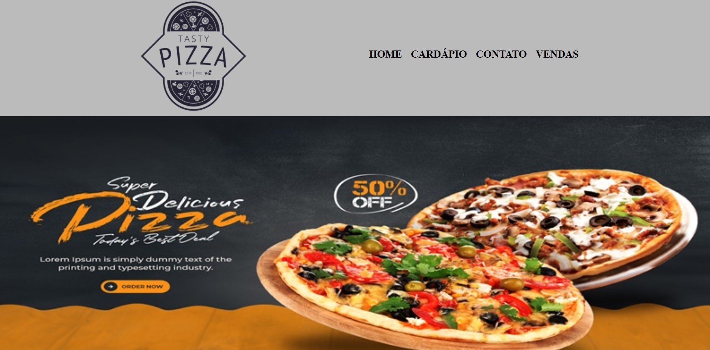

<h1 align="center"> Pizzaria Bruno's </h1>

Desenvolvido durante o curso de HTML5 e CSS3 da Alura com o objetivo colocar em prática o que foi ensinado em aula.  

  <a href="#-tecnologias">Tecnologias</a>&nbsp;&nbsp;&nbsp;|&nbsp;&nbsp;&nbsp;
  <a href="#-projeto">Projeto</a>&nbsp;&nbsp;&nbsp;|&nbsp;&nbsp;&nbsp;
  <a href="#-layout">Layout</a>&nbsp;&nbsp;&nbsp;|&nbsp;&nbsp;&nbsp;
  <a href="#memo-licença">Licença</a>

  

 

  

## 🚀 Tecnologias

Esse projeto foi desenvolvido com as seguintes tecnologias:

- HTML e CSS
- JavaScript
- Git e Github

## 💻 Projeto

O site  Pizzaria Bruno's permite o cliente conhecer a história, localização, benefícios, cardápios e ter a possibilidade de entrar em contato com o estabelecimento. Foi implementado também a possibilidade do dono da mesma calcular o pedido em seguida conseguir gerar uma planilha para abrir em programas do "Excel".

- [Visite o projeto online](https://bruno-victor32.github.io/Pizzaria-Bruno-s)

## :memo: Licença

Esse projeto está sob a licença MIT.

---

Desenvolvido por Bruno Victor